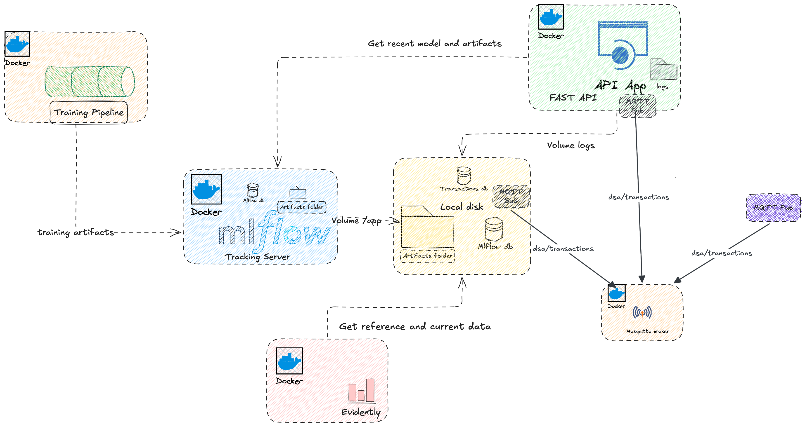

# Projet Structure

```
.
├── config
│   ├── __init__.py
│   ├── config.py
│   ├── config.yml
│   └── readme.txt
├── data
│   ├── data.pkl
│   ├── dataset.csv
│   ├── mlflow
│   │   ├── artifacts
│   │   │   ├── 221c0bc9f65d4316a8777104f27bd763
│   │   │   │   └── artifacts
│   │   │   │       └── confusion_matrix_xgboost_pipe.png
│   │   │   ├── 2f7adef3c5684eacb94eb91f43ae46bb
│   │   │   │   └── artifacts
│   │   │   │       └── confusion_matrix_fraud_detector.png
│   │   │   ├── 337ff14236e548b0bc6a16ba2f0547bd
│   │   │   │   └── artifacts
│   │   │   │       └── confusion_matrix_fraud_detector.png
│   │   │   ├── 396fcd0f706e488b9d8af3ec9e04e212
│   │   │   │   └── artifacts
│   │   │   │       └── confusion_matrix_random_forest_pipe.png
│   │   │   ├── 81f24debf81d44f0acdcdce031ee4b15
│   │   │   │   └── artifacts
│   │   │   │       └── confusion_matrix_fraud_detector.png
│   │   │   ├── aaad151cf7b54d2eb820f13af2d52c92
│   │   │   │   └── artifacts
│   │   │   │       └── confusion_matrix_fraud_detector.png
│   │   │   ├── e88fc2ff500a47f9a0013dcd0a43b7b2
│   │   │   │   └── artifacts
│   │   │   │       └── confusion_matrix_fraud_detector.png
│   │   │   ├── fa713bf7d1354b598049426774439b0d
│   │   │   │   └── artifacts
│   │   │   │       └── confusion_matrix_fraud_detector.png
│   │   │   └── models
│   │   │       ├── m-077da87703e2447a9356a43b8fe22680
│   │   │       │   └── artifacts
│   │   │       │       ├── conda.yaml
│   │   │       │       ├── MLmodel
│   │   │       │       ├── model.pkl
│   │   │       │       ├── python_env.yaml
│   │   │       │       └── requirements.txt
│   │   │       ├── m-0cba9e9407a54e3b9f35cdd096df1b80
│   │   │       │   └── artifacts
│   │   │       │       ├── conda.yaml
│   │   │       │       ├── MLmodel
│   │   │       │       ├── model.pkl
│   │   │       │       ├── python_env.yaml
│   │   │       │       └── requirements.txt
│   │   │       ├── m-15a7b3395f7a42ceb34ca712a9cb6880
│   │   │       │   └── artifacts
│   │   │       │       ├── conda.yaml
│   │   │       │       ├── MLmodel
│   │   │       │       ├── model.pkl
│   │   │       │       ├── python_env.yaml
│   │   │       │       └── requirements.txt
│   │   │       ├── m-472a563d814248f9bb4fccc2d87b08a5
│   │   │       │   └── artifacts
│   │   │       │       ├── conda.yaml
│   │   │       │       ├── MLmodel
│   │   │       │       ├── model.pkl
│   │   │       │       ├── python_env.yaml
│   │   │       │       └── requirements.txt
│   │   │       ├── m-5c2917d979e241d8bba264362f659e2e
│   │   │       │   └── artifacts
│   │   │       │       ├── conda.yaml
│   │   │       │       ├── MLmodel
│   │   │       │       ├── model.pkl
│   │   │       │       ├── python_env.yaml
│   │   │       │       └── requirements.txt
│   │   │       ├── m-b97c9ec30c6e414f87d786ad652fd2bd
│   │   │       │   └── artifacts
│   │   │       │       ├── conda.yaml
│   │   │       │       ├── MLmodel
│   │   │       │       ├── model.pkl
│   │   │       │       ├── python_env.yaml
│   │   │       │       └── requirements.txt
│   │   │       ├── m-baaa8cda2c3a4e1ba4a73efe1b73b5f7
│   │   │       │   └── artifacts
│   │   │       │       ├── conda.yaml
│   │   │       │       ├── MLmodel
│   │   │       │       ├── model.pkl
│   │   │       │       ├── python_env.yaml
│   │   │       │       └── requirements.txt
│   │   │       └── m-be2ac318c93b472b84c56c8fd1af888d
│   │   │           └── artifacts
│   │   │               ├── conda.yaml
│   │   │               ├── MLmodel
│   │   │               ├── model.pkl
│   │   │               ├── python_env.yaml
│   │   │               └── requirements.txt
│   │   └── fraud_detection.db
│   ├── preprocessed
│   ├── ReadMe.txt
│   └── transactions.db
├── docker-compose.yml
├── Dockerfile
├── README.md
├── requirements
│   ├── base.txt
│   └── mqtt.txt
├── src
│   ├── dashboard
│   │   └── readme.txt
│   ├── data-ingestion
│   │   ├── __init__.py
│   │   ├── mosquitto
│   │   │   ├── config
│   │   │   ├── data
│   │   │   └── log
│   │   ├── pub.py
│   │   ├── ReadMe.txt
│   │   ├── run_data_ingestion.sh
│   │   ├── sub.py
│   │   └── utils.py
│   ├── monitoring
│   │   └── readme.txt
│   ├── notebooks
│   │   ├── create_subset_data.ipynb
│   │   └── fraud_detection_model.ipynb
│   ├── serving
│   │   └── readme.txt
│   └── training
│       └── readme.txt
└── test
    └── readme.txt
```
## 0. Requirements

| Requirement | Notes |
|-------------|-------|
| **Docker** | Used to run the Eclipse Mosquitto broker |
| **Python 3.8+** | Virtual environment recommended |
| **paho-mqtt** | `pip install paho-mqtt` |
| **pandas** | `pip install pandas` |

---

## Overview 


## 1. Data Ingestion

### Config

You can change the config in `config/config.yml`:

```yml
broker:
  host: 127.0.0.1
  port: 1883
  topic: dsa/transactions
  interval: 30

paths:
  data: data/data.pkl
    db: data/transactions.db
```

#### Publisher

The publisher reads a fraud detection dataset from a `.pkl` file, and sends one transaction sample to the MQTT broker every 30 seconds.

Each message is a JSON-serialized transaction with a generated UUID:

```json
{
  "type": "PAYMENT",
  "amount": 1716.05,
  "nameOrig": "C913764937",
  "oldbalanceOrg": 5769.17,
  "newbalanceOrig": 4053.13,
  "nameDest": "M1387429131",
  "oldbalanceDest": 0,
  "newbalanceDest": 0,
  "datetime": "2026-05-20 00:57:04",
  "transactionID": "e03e0b58-a31b-44fb-9658-482f1a38c6dd"
}
```
#### Subscriber

The subscriber connects to the MQTT broker and listens for incoming transactions.
When the connection is established, `on_connect` automatically subscribes to the
`fraud/transactions` topic. Each time a new message arrives, `on_message` decodes it,
cleans and enriches the data (`transform`), checks that all required fields are present
and valid (`validate`), then saves it to the SQLite database.

### How to run

#### a. Create required folders

From the project root, create the Mosquitto data and log directories:

```bash
mkdir -p src/data-ingestion/mosquitto/data
mkdir -p src/data-ingestion/mosquitto/log
```
---

Samples are sent every **30 seconds**.

#### b. Run

A convenience script handles everything — it starts the Mosquitto broker, then launches the publisher and subscriber automatically.

```bash
chmod +x src/data-ingestion/run_data_ingestion.sh
./src/data-ingestion/run_data_ingestion.sh
```
> The script will:
> 1. Start the Eclipse Mosquitto Docker container
> 2. Wait for the broker to be ready
> 3. Launch the subscriber in the background
> 4. Launch the publisher

---