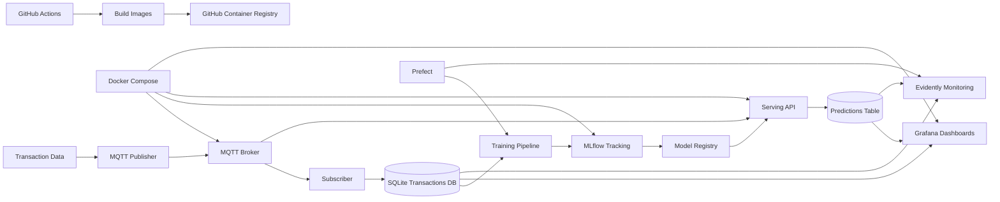
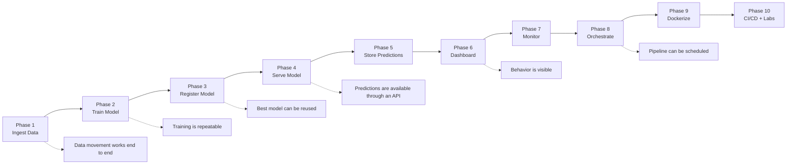
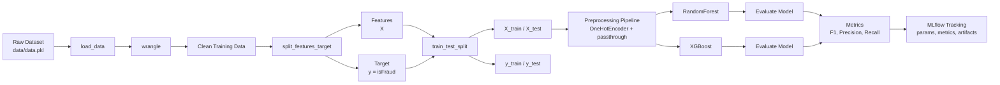
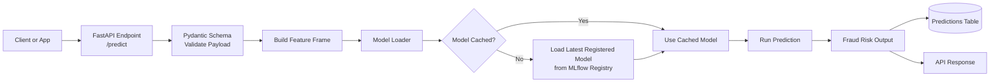
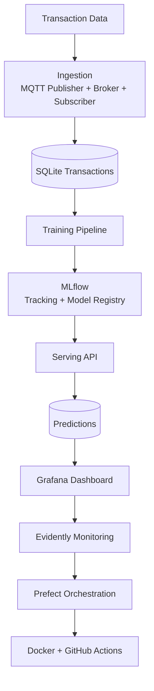

# Visuals

## End State: Local MLOps System

```mermaid
flowchart LR
    A[Transaction Data] --> B[MQTT Publisher]
    B --> C[MQTT Broker]
    C --> D[Subscriber]
    D --> E[(SQLite Transactions DB)]

    E --> F[Training Pipeline]
    F --> G[MLflow Tracking]
    G --> H[Model Registry]

    H --> I[Serving API]
    C --> I
    I --> J[(Predictions Table)]

    E --> K[Grafana Dashboards]
    J --> K

    E --> L[Evidently Monitoring]
    J --> L

    M[Prefect] --> F
    M --> L

    N[Docker Compose] --> C
    N --> G
    N --> I
    N --> K

    O[GitHub Actions] --> P[Build Images]
    P --> Q[GitHub Container Registry]
```

## A-Z Phase Map

```mermaid
flowchart LR
    P1[Phase 1<br/>Ingest Data] --> P2[Phase 2<br/>Train Model]
    P2 --> P3[Phase 3<br/>Register Model]
    P3 --> P4[Phase 4<br/>Serve Model]
    P4 --> P5[Phase 5<br/>Store Predictions]
    P5 --> P6[Phase 6<br/>Dashboard]
    P6 --> P7[Phase 7<br/>Monitor]
    P7 --> P8[Phase 8<br/>Orchestrate]
    P8 --> P9[Phase 9<br/>Dockerize]
    P9 --> P10[Phase 10<br/>CI/CD + Labs]

    P1 -.-> A[Data movement works end to end]
    P2 -.-> B[Training is repeatable]
    P3 -.-> C[Best model can be reused]
    P4 -.-> D[Predictions are available through an API]
    P6 -.-> E[Behavior is visible]
    P8 -.-> F[Pipeline can be scheduled]

```

## Phase 2: Training Pipeline

```mermaid
flowchart LR
    A[Raw Dataset<br/>data/data.pkl] --> B[load_data]
    B --> C[wrangle]
    C --> D[Clean Training Data]

    D --> E[split_features_target]
    E --> X[Features<br/>X]
    E --> Y[Target<br/>y = isFraud]

    X --> S[train_test_split]
    Y --> S

    S --> XT[X_train / X_test]
    S --> YT[y_train / y_test]

    XT --> P[Preprocessing Pipeline<br/>OneHotEncoder + passthrough]

    P --> RF[RandomForest]
    P --> XGB[XGBoost]

    RF --> ERF[Evaluate Model]
    XGB --> EXGB[Evaluate Model]

    ERF --> M[Metrics<br/>F1, Precision, Recall]
    EXGB --> M

    M --> ML[MLflow Tracking<br/>params, metrics, artifacts]
```

## Phase 4: Serving API

```mermaid
flowchart LR
    A[Client or App] --> B[FastAPI Endpoint<br/>/predict]
    B --> C[Pydantic Schema<br/>Validate Payload]

    C --> D[Build Feature Frame]
    D --> E[Model Loader]

    E --> F{Model Cached?}
    F -- Yes --> G[Use Cached Model]
    F -- No --> H[Load Latest Registered Model<br/>from MLflow Registry]
    H --> G

    G --> I[Run Prediction]
    I --> J[Fraud Risk Output]
    J --> K[(Predictions Table)]
    J --> L[API Response]
```

## Simple Vertical MLOps Summary

```mermaid
flowchart TD
    A[Transaction Data] --> B[Ingestion<br/>MQTT Publisher + Broker + Subscriber]
    B --> C[(SQLite Transactions)]
    C --> D[Training Pipeline]
    D --> E[MLflow<br/>Tracking + Model Registry]
    E --> F[Serving API]
    F --> G[(Predictions)]
    G --> H[Grafana Dashboard]
    H --> I[Evidently Monitoring]
    I --> J[Prefect Orchestration]
    J --> K[Docker + GitHub Actions]
```
